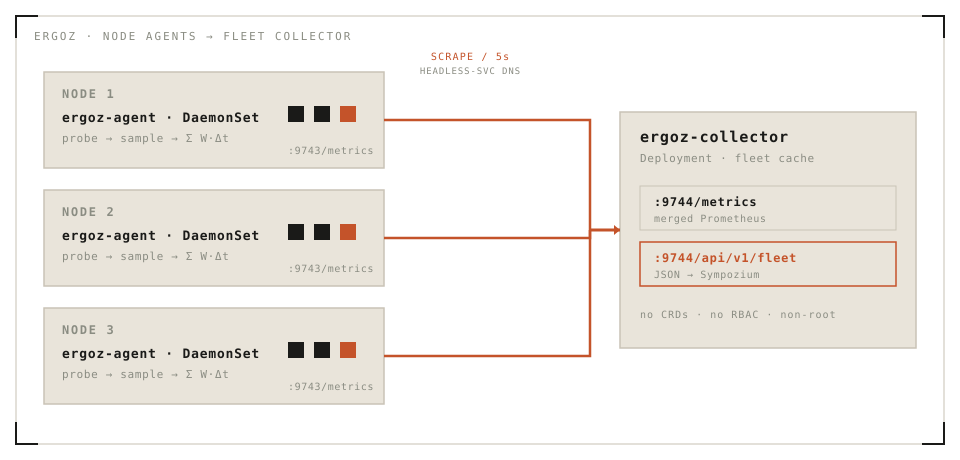

<p align="center">
  <picture>
    <source media="(prefers-color-scheme: dark)" srcset="assets/brand/logo-horizontal-dark.svg">
    
  </picture>
</p>

**Vendor-neutral accelerator power telemetry for Kubernetes — consumer hardware first.**

Ergoz (Greek ἔργον *ergon*, "work" — the root of *energy*) measures the current
power draw of accelerators (GPUs, NPUs, …) across a fleet and exposes it as
Kubernetes-native telemetry. It exists because the incumbents are vendor silos:
dcgm-exporter is datacenter-NVIDIA, Kepler is RAPL+NVML in practice, AMD's
exporter is Instinct-only. Nothing covers the commodity hardware people run
local inference on — and on AMD consumer hardware the kernel already exposes
everything needed, world-readable, with **zero vendor userspace**.

First consumer: [Sympozium](https://github.com/sympozium-ai/sympozium)
(placement decisions and the electricity dimension of run cost estimation).

## Quick links

| Get started | Operate | Reference | Project |
|---|---|---|---|
| [Install the CLI](#install-the-cli) | [`ergoz status`](#cli) | [Metrics](#metrics) | [Architecture](#architecture) |
| [Deploy to a cluster](#deploy-to-a-cluster) | [Upgrade](#upgrade) | [Fleet JSON API](#fleet-json-api) | [Security notes](#security-notes) |
| [Private-registry images](#private-registry-images) | [Uninstall](#uninstall) | [Verified hardware](#verified-hardware) | [Roadmap](#roadmap) |
| [Helm without the CLI](#helm-without-the-cli) | [Fidelity tuning](#fidelity-tuning) | [Configuration](#configuration) | [Development](#development) |

## Install the CLI

While the repo is private (uses your existing `gh` auth):

```bash
gh api repos/sympozium-ai/ergoz/contents/install.sh -H "Accept: application/vnd.github.raw" | sh
```

Once public, the sympozium-style one-liner works as-is:

```bash
curl -fsSL https://raw.githubusercontent.com/sympozium-ai/ergoz/main/install.sh | sh
```

Append `-s -- --local` to install to `~/.local/bin` without sudo. With a Go
toolchain: `GOPRIVATE=github.com/sympozium-ai go install
github.com/sympozium-ai/ergoz/cmd/ergoz@latest`.

Every release ships `ergoz-{linux,darwin}-{amd64,arm64}` binaries, a packaged
Helm chart, and `checksums.txt` as release assets, plus a multi-arch container
image at `ghcr.io/sympozium-ai/ergoz:vX.Y.Z`.

## Deploy to a cluster

```bash
ergoz install          # embedded Helm chart → release "ergoz" in ergoz-system
ergoz status
```

`ergoz install` creates a **real Helm release** — visible in `helm list -n
ergoz-system`. No CRDs and no RBAC are created; the agent runs non-root with a
read-only `/sys` hostPath.

For a kind-sideloaded image: `ergoz install --image-tag dev`.

### Private-registry images

While the ghcr package is private, hand the installer a token with
`read:packages` and it creates the pull secret and wires `imagePullSecrets`:

```bash
ergoz install --ghcr-token "$(gh auth token)"
```

### Helm without the CLI

```bash
helm install ergoz charts/ergoz -n ergoz-system --create-namespace
# or from a release asset:
helm install ergoz ergoz-<version>.tgz -n ergoz-system --create-namespace
```

## CLI

```
$ ergoz status
ERGOZ FLEET  ·  1/1 agents up  ·  total 18.0 W  ·  scraped 13:52:02
└─ kind-control-plane  18.0 W
   ├─ gpu  0000:c3:00.0   amdgpu (1002:1586)  18.0 W  [socket 18.4 W · gfx 0.0 W · npu 0.0 W · cpu_cores 4.4 W]
   └─ npu  0000:c4:00.1   amdxdna (1022:17f0)  suspended (0 W)
```

`ergoz status` reads the collector through the kube-apiserver **service
proxy** — no port-forward needed. `--kubeconfig`/`--context` behave as usual.

### Upgrade

Re-run `ergoz install` (optionally with a new `--image-tag`): it detects the
existing release and performs a Helm upgrade, bumping the revision.

### Uninstall

```bash
ergoz uninstall
```

Removes the Helm release and the namespace. Installs made by the pre-Helm CLI
(raw manifests) are detected and cleaned up via namespace deletion.

## Metrics

| Metric | Meaning |
|---|---|
| `ergoz_accel_power_watts{node,kind,vendor_id,device_id,pci,driver}` | Instantaneous board/socket power (hwmon) |
| `ergoz_accel_component_power_watts{...,component}` | Decomposed power where the ASIC exposes it: `socket`, `gfx`, `npu`, `cpu_cores`. Fields failing per-ASIC sanity validation are **absent, never zero** |
| `ergoz_accel_runtime_suspended{...}` | 1 = device runtime-PM suspended; power reported as synthetic 0 W rather than waking it (for NVIDIA this gate runs **before** any NVML call — a query would wake an RTD3-suspended GPU) |

Ergoz reports **current power draw**, point-in-time on every scrape — it does
not accumulate energy totals. (Watt-hours are just `powerWatts × time`;
integrate downstream in Prometheus/your dashboard if you want them.)

Names are accelerator-neutral: `kind` is a label (`gpu`, `npu`, …), so new
device classes need no renames. The collector re-exposes every agent's
`ergoz_*` families merged at `:9744/metrics` for one-stop Prometheus scraping.

## Fleet JSON API

`GET :9744/api/v1/fleet` on the collector — the consumer-friendly view
(Sympozium's integration point):

```json
{
  "agentsUp": 1, "agentsTotal": 1, "totalWatts": 18.0, "staleDevices": 0,
  "devices": [{"node":"...","kind":"gpu","pci":"0000:c3:00.0",
               "powerWatts":18.0,"components":{"socket":18.4,"gfx":0.0},
               "suspended":false,"stale":false}]
}
```

Each device is a current reading. If an agent stops responding its devices
stay listed with `"stale": true` (last-known value) and drop out of
`totalWatts` — a missed scrape is visible, not a silent gap.

## Verified hardware

Empirical, not aspirational:

| Hardware | Source | Status |
|---|---|---|
| AMD Strix Halo APU (`amdgpu`) | hwmon `power1_input` + `gpu_metrics` v3.0 | Live: socket/gfx/per-core decomposition agrees with hwmon within 0.2 W |
| AMD XDNA NPU (`amdxdna`) | runtime_status | Live: reported suspended, synthetic 0 W |
| Intel Lunar Lake iGPU (`xe`) | — | Live: correctly reported unmeasurable (no hwmon power exists; a known kernel gap) |
| NVIDIA GeForce | NVML via runtime dlopen (purego — no cgo, static build preserved) | Synthetic: real dlopen path validated against a compiled stub `libnvidia-ml.so.1` (power, RTD3 suspend gate, string marshaling); hardware validation pending |
| Intel Arc dGPU | xe/i915 `energy1_input` (µJ counter) | Planned (Phase 1) |
| CPU package (RAPL) | `/sys/class/powercap` (root-only) | Planned (Phase 2, opt-in privileged mode) |

The `gpu_metrics` parser trusts only fields validated on real silicon: 0xFFFF
sentinels are dropped, `average_all_core_power` is recomputed from the
per-core array (observed ~2× disagreement), and gfx > socket readings are
discarded rather than exported. See `internal/gpumetrics`.

## Configuration

Helm values (`charts/ergoz/values.yaml`):

| Value | Default | Meaning |
|---|---|---|
| `image.repository` / `image.tag` | ghcr, `v{appVersion}` | Container image; `--image-tag` sets this |
| `imagePullSecrets` | `[]` | `--ghcr-token` sets `[{name: ghcr-pull}]` |
| `nvidia.libHostDir` | `""` | Host dir with `libnvidia-ml.so.1`, mounted ro when set (unneeded with the NVIDIA container toolkit) |
| `agent.sampleInterval` | `1s` | Power sampling cadence (clamped to ≥1s floor) |
| `agent.tolerations` | `[{operator: Exists}]` | Tolerate tainted GPU nodes by default |
| `collector.scrapeInterval` | `5s` | Agent scrape cadence |
| `agent.resources` / `collector.resources` | small | Pod resources |

### Fidelity tuning

A hwmon read costs ~5 µs, so sampling is effectively free down to sub-second
intervals; the real cost axis is metric fan-out. Suggested tiers:
`sampleInterval: 1s` + `scrapeInterval: 5s` (default, near-realtime),
`30s`/`1m` (dashboards), `5m` (capacity trending). The exported energy counter
integrates at sample resolution regardless of how rarely you scrape.

## Architecture

<p align="center">
  <picture>
    <source media="(prefers-color-scheme: dark)" srcset="assets/brand/arch-dark.svg">
    
  </picture>
</p>

Each **agent** walks the node's devices once at startup, then samples on a
loop: amdgpu hwmon `power1_input` (µW), the amdgpu `gpu_metrics` v3.0 blob
(validated decode), NVIDIA via NVML, and `power/runtime_status` as the suspend
gate — integrating energy as Σ&nbsp;W·Δt and serving `:9743/metrics`. The
**collector** scrapes every agent over headless-Service DNS and re-serves the
fleet as merged Prometheus metrics plus the JSON API on `:9744`.

Device identity comes from
[`llmfit-dra/pkg/probe`](https://github.com/sympozium-ai/llmfit-dra) — one
source of truth for accelerator identification across the org. No CRDs, no
RBAC (nothing talks to the Kubernetes API), non-root end to end.

## Security notes

- The agent mounts host `/sys` **read-only** and runs non-root,
  `readOnlyRootFilesystem`, all capabilities dropped, RuntimeDefault seccomp.
- Both pods set `automountServiceAccountToken: false` — nothing talks to the
  Kubernetes API.
- Power telemetry is a side channel: fleet-wide watts can reveal that/when
  workloads run. Keep the collector Service cluster-internal and put RBAC or
  network policy in front of anything that re-exports it. The 1 s sample
  interval is a floor **enforced in code** (sub-second requires the explicit
  `ERGOZ_UNSAFE_FAST_SAMPLING=1` opt-in), so faster sampling can't be turned
  on by a stray Helm value.

## Development

```bash
make build          # binaries in bin/ (agent, collector, CLI)
make test           # go test -race
make docker-build   # single image, two entrypoints
helm lint charts/ergoz
bin/ergoz install --image-tag dev && bin/ergoz status
```

Releases are cut by release-please (conventional commits); each release
publishes CLI binaries + packaged chart as assets and pushes the multi-arch
image to ghcr. `workflow_dispatch` on the release workflow re-publishes
assets for an existing tag.

## Roadmap

- **Phase 1**: ~~NVIDIA GeForce via NVML~~ shipped (synthetic-validated; the
  remaining gate measurements need real hardware — NVML call latency on GSP
  drivers, RTD3 behavior, energy-counter support per SKU). Still open: Intel
  Arc energy counters (ΔµJ/Δt with wrap handling); per-ASIC `gpu_metrics`
  v1/v2 tables for AMD dGPUs and older APUs.
- **Phase 2**: opt-in privileged mode for RAPL CPU package power; OTLP push
  exporter; device→pod attribution via kubelet pod-resources (consumed by
  llmfit-dra/Sympozium — Ergoz itself stays observability-only).
